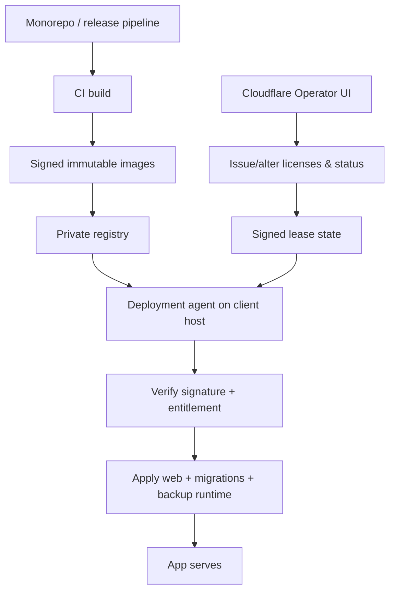

The repository remains a monorepo, but operations are split by trust boundary:

- **Vendor control plane** (Cloudflare): license authoring, entitlements, module policy, seat limits, and release registry metadata.
- **Client runtime** (Quandatics host): PostgreSQL + runtime containers only.

## Architecture sketch

## Runtime split

- **Core web image**: authenticated app container used by users.
- **Migrator image**: applies DB schema changes safely and exits.
- **Backup image**: produces and verifies restore evidence.
- **Agent image**: applies signed release manifests and handles rollback.

The client host has no source checkout for deployments. It receives image digests, license proof, and runtime parameters only.

## Module and entitlement model

Modules are no longer simple local booleans.

- A license envelope defines allowed modules for the active plan.
- The app reads entitlement from signed runtime state and enforces:
  - page and menu visibility
  - route and action checks
  - write/modify behavior where applicable
- Module changes are applied through control-plane operations and then rolled into the next signed release.

## Staging

Staging is an isolated copy of the same architecture and data shape. It validates:

- migration order and compatibility
- signed image verification
- entitlement transitions
- health checks and rollback readiness

The client app should not be used to run deployments, issue seats, or edit entitlement state.

## Settings and scope

Repository development still happens centrally, but operations are intentionally
split so client users keep access to business features while deployment controls
remain controlled by the vendor.

## Why this architecture

- Source remains vendor-owned.
- Client-side cannot extract build metadata or secrets.
- Production cutovers are reproducible from digests and audit records.
- Rollbacks are deterministic because every release is immutable.
