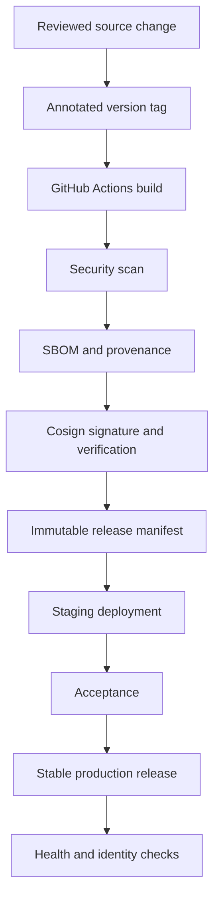

# Release versioning

Quandatics CRM uses immutable, signed container releases. Staging validates a
release candidate before the same accepted code is promoted to production.

## Version format

Versions follow Semantic Versioning:

| Version | Purpose |
| --- | --- |
| `v1.2.14-rc.1` | Staging release candidate |
| `v1.2.14` | Stable production release |
| `v1.3.0` | Backward-compatible feature release |
| `v2.0.0` | Breaking release |

Production never deploys `latest`. Every service uses an immutable image
digest, so a deployed release cannot silently change behind its version tag.

## Release architecture



The release contains four independently signed images: web application,
database migrator, backup runtime, and deployment agent. The deployment host
pulls images only; it does not receive source or build the application.

## Staging and production

| Property | Staging | Production |
| --- | --- | --- |
| URL | `staging.app.quandatics.com` | `app.quandatics.com` |
| Channel | `beta` | `stable` |
| Data | Generated or anonymised | Customer data |
| Database and storage | Isolated | Isolated |
| Deployment identity | Staging-only | Production-only |
| Access | Cloudflare Access and CRM login | CRM login |

A staging failure does not change production data, volumes, or deployment
identity. Production promotion requires a fresh verified encrypted backup and
retains the prior signed runtime for rollback.

## See deployed version

Authenticated users can open **Settings → Version** or visit:

```text
/settings/system
```

The page shows:

- Release tag
- Release channel
- Deployment environment
- Short image digest
- Database migration version
- Deployment time

Only safe operational metadata is displayed. Source commits, credentials,
registry tokens, signing keys, and full deployment configuration are not shown.

## Promotion controls

Client developers can validate staging and report acceptance. They cannot sign
images, alter approved digests, issue licenses, or deploy production. Final
promotion remains a vendor-controlled operation.

If a rollout fails identity, migration, agent, or health checks, deployment
restores the prior runtime configuration. Database migrations remain
forward-compatible; rollback never deletes customer volumes.
